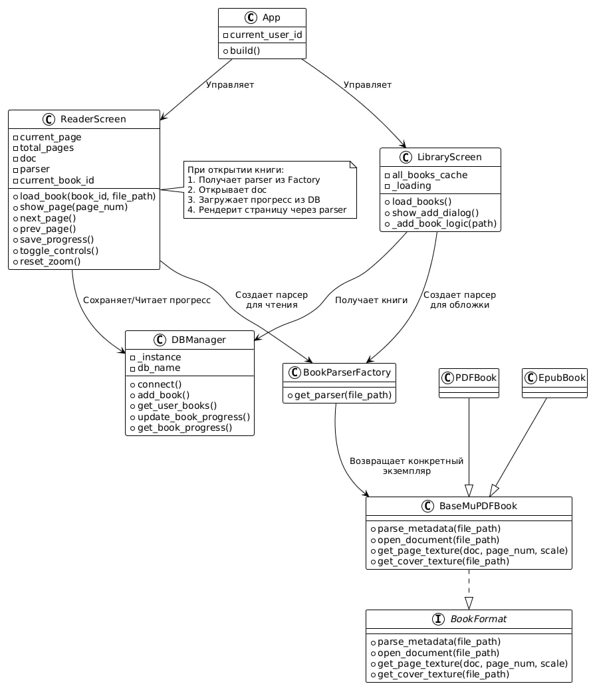
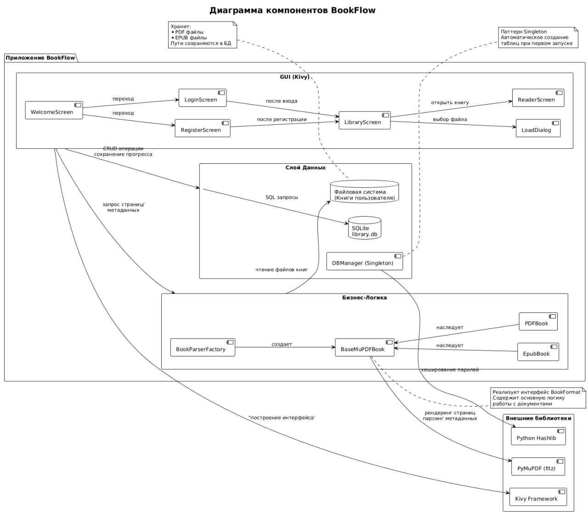

# Анализ Архитектуры Приложения BookFlow

## Часть 1. Проектирование архитектуры «To Be»

### 1. Тип приложения
Приложение относится к типу **десктопных/мобильных клиентских приложений** (Client Application), реализованных на фреймворке **Kivy** для обеспечения кросс-платформенности (Android, iOS, Desktop).

### 2. Стратегия развертывания и хранение данных
Проект использует **локальное хранение данных** с акцентом на автономность, согласно требованиям SRS.

*   **Уровень представления/логики:** Приложение реализовано как **единый процесс (монолит)** на Python/Kivy.
*   **Уровень данных:** Используется **локальная база данных SQLite** (`library.db`) для хранения метаданных о книгах и прогрессе чтения.
*   **Хранение контента:** Сами файлы книг (`.pdf`, `.epub`) хранятся в файловой системе устройства.
*   **Автономность:** Основная функциональность доступна **без подключения к интернету** после первоначальной установки и импорта.

### 3. Обоснование выбора технологий

| Технология | Назначение | Обоснование |
| :--- | :--- | :--- |
| **Python & Kivy** | Основной стек разработки и UI | Обеспечивают кросс-платформенность и быструю разработку клиентского интерфейса. |
| **SQLite** | Локальное хранилище данных | Простота развертывания (не требует внешнего сервера БД), идеально подходит для локального хранения данных одного пользователя. |
| **PyMuPDF (fitz)** | Парсинг и рендеринг книг | Высокая производительность для открытия и отрисовки страниц PDF/EPUB в текстуры Kivy. |
| **Buildozer** | Сборка для мобильных платформ | Стандартный инструмент для упаковки Kivy-приложений в нативные пакеты. |

### 4. Показатели качества

*   **Доступность/Офлайн-режим:** Приложение полностью **доступно для офлайн-использования** после установки и импорта книг.
*   **Удобство использования (Usability):** Интерфейс спроектирован как **минималистичный** (без рекламы) с фокусом на удобство чтения и управления библиотекой.
*   **Сопровождаемость:** Код разделен на логические модули: `database.py` (доступ к данным), `core.py` (бизнес-логика парсинга), `main.py` (управление состоянием/переходами) и `interface.kv` (представление).

### 5. Реализация сквозной функциональности

*   **Аутентификация:** Реализована базовая аутентификация с **локальным хранением хэшей** паролей в SQLite.
*   **Управление файлами:** Используется паттерн **Factory** (`BookParserFactory`) для выбора нужного парсера (PDF или EPUB).
*   **Сохранение прогресса:** Автоматическое сохранение номера текущей страницы в БД при закрытии книги или перелистывании.

### 6. Структурная схема приложения

**Описание схемы:**

*   **UI Layer (`interface.kv`):** Отвечает за внешний вид, привязан к ID в Python-классах.
*   **Application Control Layer (`main.py`):** Содержит контроллеры экранов (например, `LibraryScreen`), которые координируют UI и бизнес-логику.
*   **Business Logic Layer (`core.py`):** Содержит классы парсеров (`PDFBook`, `EpubBook`, `BookParserFactory`).
*   **Data Access Layer (`database.py`):** Единственный слой, который напрямую взаимодействует с локальной SQLite БД.

---

## Часть 2. Анализ архитектуры «As Is»

В данной части анализируется текущая структура проекта, которая представляет собой **Слойчатый Монолит (Layered Monolith)**.

### Особенности реализации «As Is»:

1.  **Монолитная структура:** Все компоненты (UI, логика, работа с файлами, БД) запущены в одном процессе, что обеспечивает высокую скорость отклика, но ограничивает горизонтальное масштабирование.
2.  **Четкое разделение по файлам:** Логика грамотно разделена по файлам, что соответствует требованиям сопровождения:
    *   **`database.py`**: Инкапсулирует всю работу с SQLite.
    *   **`core.py`**: Реализует полиморфизм через `BookParserFactory` для работы с разными форматами.
    *   **`main.py`**: Выступает в роли контроллера, связывая UI (`interface.kv`) с данными и логикой.

### Часть 3. Пути улучшения архитектуры

Поскольку приложение не является микросервисной системой, рефакторинг направлен на повышение чистоты кода и расширение функционала.

1.  **Улучшение слоя чтения (UX):**
    *   **Проблема:** Навигация по страницам пока осуществляется только по кнопкам.
    *   **Решение (MVP):** Внедрить поддержку жестов (свайп) для перелистывания страниц. Реализовать плавное скрытие/отображение элементов управления (`toggle_controls`). (Запланировано в Спринте 3).
2.  **Разделение контроллеров:**
    *   **Проблема:** Классы экранов (`LibraryScreen`, `ReaderScreen` в `main.py`) становятся слишком большими, выполняя и UI, и бизнес-логику.
    *   **Решение:** Выделить логику обработки данных (например, фильтрацию книг, управление прогрессом) в отдельные **Controller/ViewModel** классы, чтобы экраны Kivy отвечали только за отображение.
3.  **Контейнеризация:**
    *   **Проблема:** Запуск приложения может зависеть от локально установленных библиотек (PyMuPDF).
    *   **Решение:** Упаковка приложения в **Docker-контейнер** для стандартизации среды разработки и упрощения сборки для развертывания. (Запланировано в Спринте 3).

**Заключение**
Архитектура BookFlow ориентирована на **простоту, автономность и удобство конечного пользователя**, что достигается за счет локального хранения данных и использования паттернов в рамках монолитного приложения Kivy.
